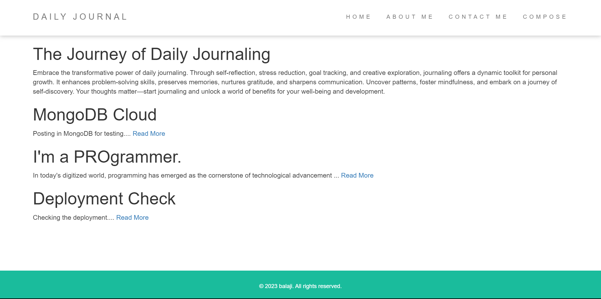
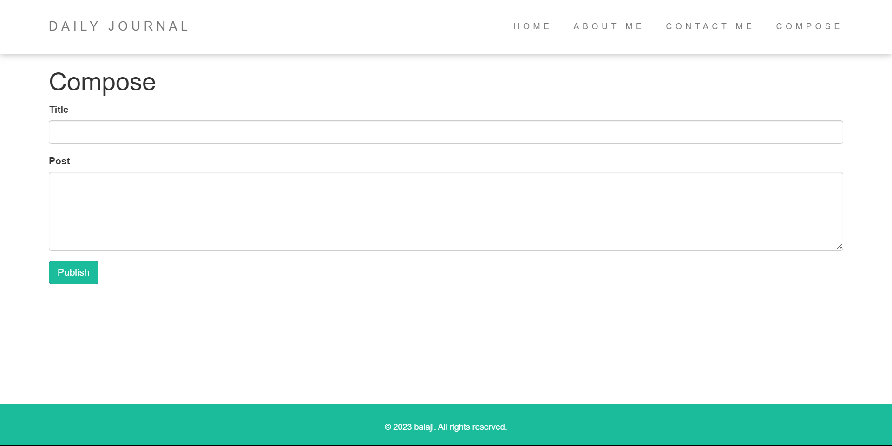
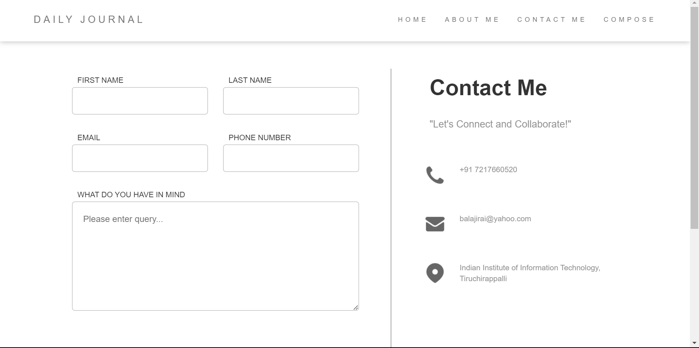

# Daily Journal

Daily Journal is a web application which allow users to share their daily thoughts and experiences.

---

---

## Technologies used:

- Node js
- Express js
- EJS
- MongoDb
- Mongoose

---

## Contributors

- Balaji

---

## License & Copyright

Copyright [©balaji](https://github.com/balajirai)

Licensed under the [MIT License](LICENSE)
